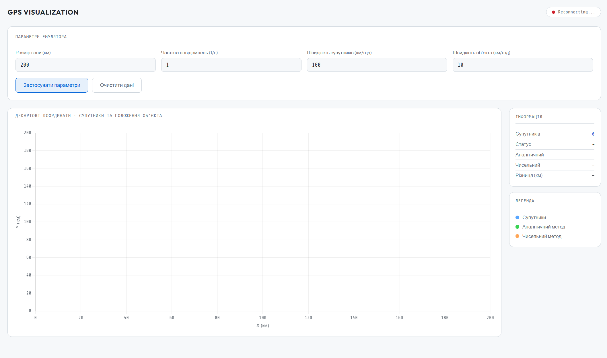
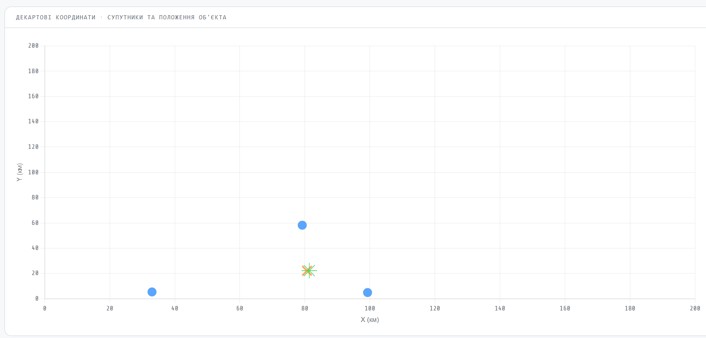
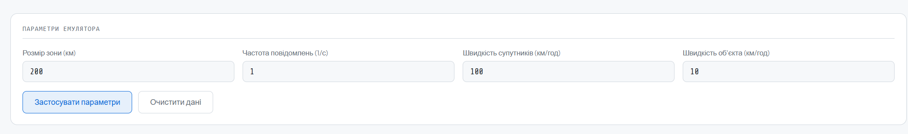

# Розробка додатку для візуалізації вимірювань GPS
## Бучко Вікторія ІПЗ-4.02

---

## Мета

- Розробити веб-додаток, що зчитує дані з емульованої вимірювальної частини GPS
- Реалізувати аналітичний та чисельний методи розрахунку координат об'єкта
- Відобразити положення супутників та об'єкта на графіку в декартових координатах
- Реалізувати інтерфейс для керування параметрами емулятора через API

---

## 0. Передумови виконання

Перед запуском додатку необхідно підняти Docker-контейнер з емулятором GPS:

```bash
docker pull iperekrestov/university:gps-emulation-service
docker run --name gps-emulator -p 4001:4000 iperekrestov/university:gps-emulation-service
```
---

## Критерії виконання

### 1. Підключення до WebSocket сервера та зчитування даних

Додаток підключається до `localhost:4001` одразу при завантаженні. Кожне повідомлення парситься з JSON і зберігається у Map за ідентифікатором супутника

```javascript
function connectWS() {
    ws = new WebSocket('ws://localhost:4001');

    ws.onopen = () => setStatus(true, 'Connected');

    ws.onmessage = (event) => {
        const data = JSON.parse(event.data);
        satellitesMap.set(data.id, data);
        processData();
    };

    ws.onclose = () => {
        setStatus(false, 'Reconnecting...');
        setTimeout(connectWS, 2000);
    };
}
```

---

### 2. Інтерфейс для зміни параметрів емулятора через API

Параметри з форми надсилаються POST-запитом на `http://localhost:4001/config`. Після успішного застосування масштаб графіка оновлюється і дані очищуються

```javascript
async function applyConfig() {
    zoneSize = parseFloat(document.getElementById('inZone').value) || 200;

    const config = {
        emulationZoneSize: zoneSize,
        messageFrequency:  parseFloat(document.getElementById('inFreq').value),
        satelliteSpeed: parseFloat(document.getElementById('inSatSpeed').value),
        objectSpeed: parseFloat(document.getElementById('inObjSpeed').value)
    };

    const res = await fetch('http://localhost:4001/config', {
        method: 'POST',
        headers: { 'Content-Type': 'application/json' },
        body: JSON.stringify(config)
    });

    if (res.ok) {
        chart.options.scales.x.max = zoneSize;
        chart.options.scales.y.max = zoneSize;
        clearData();
    }
}
```

---

### 3. Розрахунок положення об'єкта двома методами

Обрано **середній рівень складності** - власна реалізація градієнтного спуску без зовнішніх математичних бібліотек

Для розрахунку обираються 3 супутники

```javascript
function getThreeSatellites() {
    const all = Array.from(satellitesMap.values());
    if (all.length < 3) return null;
    all.sort((a, b) => (a.receivedAt - a.sentAt) - (b.receivedAt - b.sentAt));
    return all.slice(0, 3);
}
```

**Аналітичний метод** базується на тому, що кожен супутник задає коло. Його координати - це центр, а відстань до об’єкта - радіус. Точка перетину цих кіл і є шуканим положенням. Щоб її знайти, рівняння кіл перетворюються з різниці пар рівнянь (s2–s1 та s3–s2) отримується система двох лінійних рівнянь. Далі ця система розв’язується через визначник, у результаті чого обчислюються координати точки

```javascript
function analyticalMethod(sats) {
    const [s1, s2, s3] = sats;
    const d1 = C * Math.max(0, (s1.receivedAt - s1.sentAt) / 1000);
    const d2 = C * Math.max(0, (s2.receivedAt - s2.sentAt) / 1000);
    const d3 = C * Math.max(0, (s3.receivedAt - s3.sentAt) / 1000);

    const A = 2 * (s2.x - s1.x);
    const B = 2 * (s2.y - s1.y);
    const C_val = d1*d1 - d2*d2 + s2.x**2 - s1.x**2 + s2.y**2 - s1.y**2;

    const D = 2 * (s3.x - s2.x);
    const E = 2 * (s3.y - s2.y);
    const F = d2*d2 - d3*d3 + s3.x**2 - s2.x**2 + s3.y**2 - s2.y**2;

    const det = A * E - B * D;
    if (Math.abs(det) < 1e-6) return null;

    return {
        x: (C_val * E - B * F) / det,
        y: (A * F - C_val * D) / det
    };
}
```

**Чисельний метод**  використовує градієнтний спуск, тобто поступове наближення до правильної відповіді. Спочатку береться початкова точка - центр між супутниками. Потім на кожній ітерації обчислюється похибка як різниця між виміряними та розрахованими відстанями, визначається напрямок у якому ця похибка зменшується і координати трохи зміщуються в цей бік. Після кількох ітерацій точка сходиться до положення, яке найкраще відповідає всім вимірюванням

```javascript
function numericalMethod(sats) {
    const measured = sats.map(s => C * Math.max(0, (s.receivedAt - s.sentAt) / 1000));

    let x = (sats[0].x + sats[1].x + sats[2].x) / 3;
    let y = (sats[0].y + sats[1].y + sats[2].y) / 3;

    const alpha = 0.01;

    for (let i = 0; i < 200; i++) {
        let gx = 0, gy = 0;
        for (let j = 0; j < sats.length; j++) {
            const dx = x - sats[j].x;
            const dy = y - sats[j].y;
            const dist = Math.sqrt(dx * dx + dy * dy) || 1e-9;
            const err = dist - measured[j];
            gx += err * dx / dist;
            gy += err * dy / dist;
        }
        x -= alpha * gx;
        y -= alpha * gy;
    }

    return { x, y };
}
```

---

### 4. Відображення супутників та двох точок об'єкта на графіку

Графік побудовано на Chart.js. Три датасети оновлюються після кожного нового повідомлення. Якщо супутник виходить за межі зони розрахунок призупиняється, попередні позиції залишаються на графіку

```javascript
function processData() {
    const sats = getThreeSatellites();
    if (!sats) return;

    chart.data.datasets[0].data = sats.map(s => ({ x: s.x, y: s.y }));

    const inBounds = allSatsInBounds(sats);
    if (inBounds) {
        analyticPos = analyticalMethod(sats);
        numericPos  = numericalMethod(sats);
        chart.data.datasets[1].data = analyticPos ? [{ x: analyticPos.x, y: analyticPos.y }] : [];
        chart.data.datasets[2].data = numericPos  ? [{ x: numericPos.x,  y: numericPos.y  }] : [];
    }

    chart.update('none');
    updateInfoPanel(3, inBounds);
}
```

На графіку використовуються різні маркери та кольори:
- **Сині кола** - супутники
- **Зелена зірка** - аналітичний метод
- **Помаранчевий хрест** - чисельний метод

---

### 5. Інтерфейс користувача


Рис. 1 - Загальний вигляд додатку з підключеним емулятором


Рис. 2 - Графік з супутниками та двома точками об'єкта


Рис. 3 - Форма зміни параметрів емулятора

---

### 6. Структура та коментарі коду

Код розбито на незалежні функції з однією відповідальністю кожна:

| Функція | Призначення |
|---|---|
| `initChart()` | ініціалізація графіка Chart.js |
| `connectWS()` | підключення до WebSocket |
| `getThreeSatellites()` | вибір 3 супутників з найменшою затримкою |
| `allSatsInBounds()` | перевірка меж зони |
| `analyticalMethod()` | аналітичний розрахунок координат |
| `numericalMethod()` | чисельний розрахунок (градієнтний спуск) |
| `processData()` | координація розрахунків та оновлення графіка |
| `updateInfoPanel()` | оновлення текстової інфо-панелі |
| `applyConfig()` | надсилання параметрів через API |
| `clearData()` | очищення даних і графіка |

---

## Висновок

У ході виконання роботи розроблено веб-додаток для візуалізації GPS-вимірювань. У ньому реалізовано два способи обчислення координат. Аналітичний метод дає дуже точний результат, якщо дані ідеальні й без помилок. Чисельний метод, який використовує градієнтний спуск, знаходить приблизно той самий результат за кілька ітерацій (близько 200), але краще працює в умовах реальних вимірювань, де є похибки або шум
